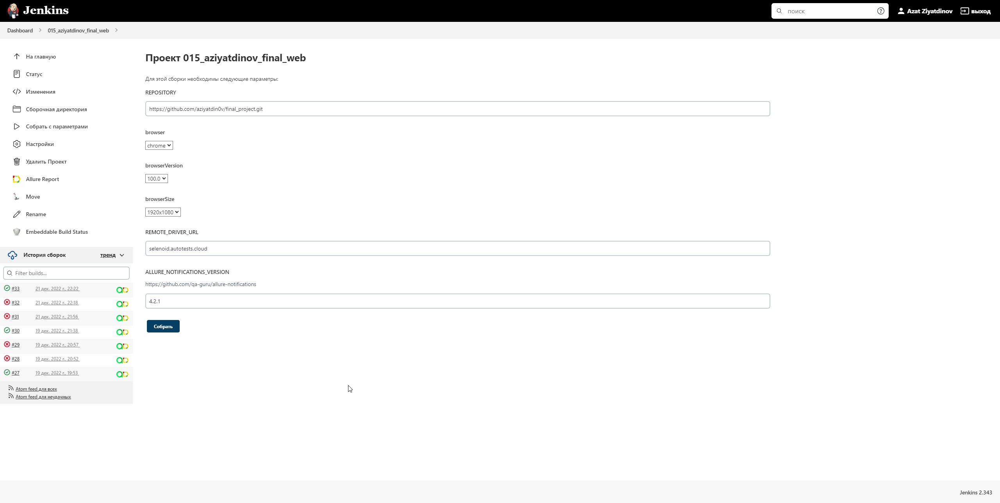
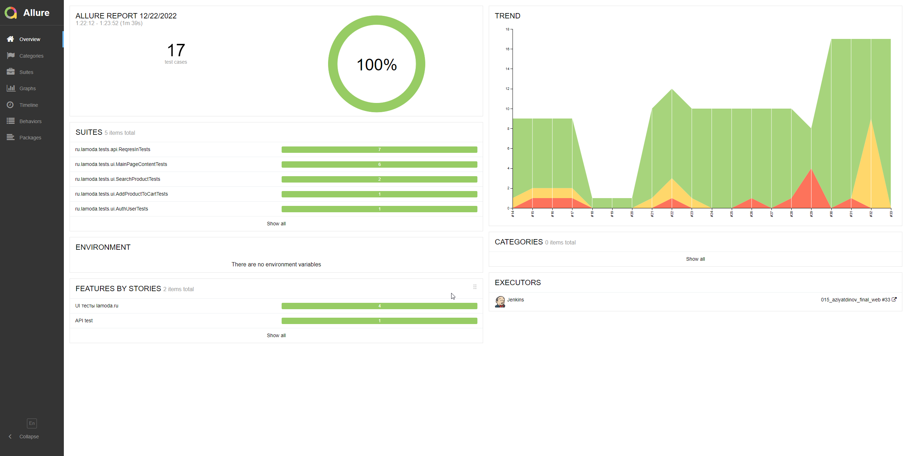
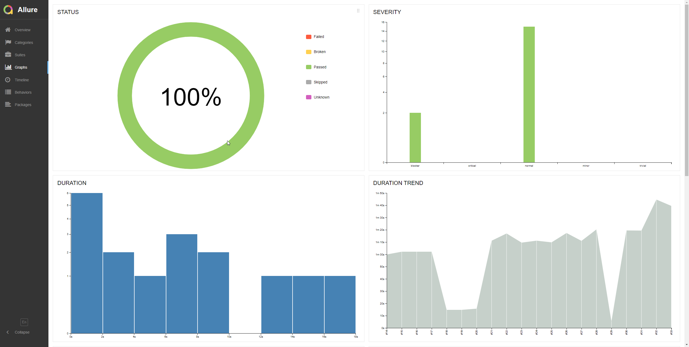
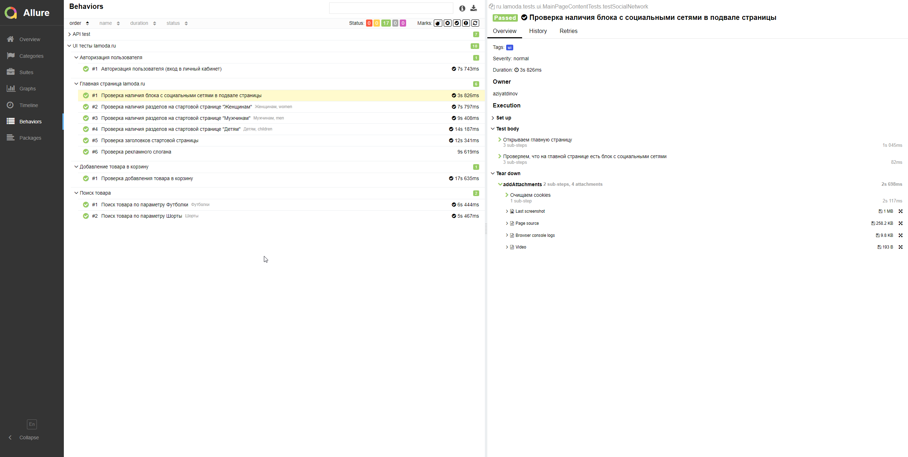
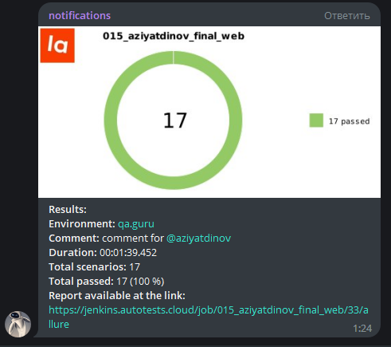

# Дипломный проект по тестированию интернет-магазина [Lamoda](https://www.lamoda.ru/)

## :open_book: Содержание:

- [Технологии, используемые в данном проекте](#gear-Технологии-используемые-в-данном-проекте)
- [Тест кейсы](#heavy_check_mark-Тест-кейсы)
- [Запуск тестов из терминала (локально)](#computer-запуск-тестов-из-терминала)
- [Запуск тестов в Jenkins](#-запуск-тестов-из-jenkins)
- [Allure отчет](#-allure)
- [Уведомления в Telegram](#-telegram)
- [Видео прохождения тестов]()
- [Интеграция с AllureTestOps]()

## :gear: Технологии, используемые в данном проекте

<p align="left">
<a href="https://www.jetbrains.com/idea/"></a>
<a href="https://www.java.com/"></a>
<a href="https://github.com/"></a>
<a href="https://junit.org/junit5/"></a>
<a href="https://gradle.org/"></a>
<a href="https://selenide.org/"></a>
<a href="https://aerokube.com/selenoid/"></a>
<a href="https://github.com/allure-framework/allure2"></a>
<a href="https://www.jenkins.io/"></a>
<a href="https://web.telegram.org/"></a>
<a href="https://qameta.io/"></a>
</p>

В данном проекте автотесты написаны на **Java** с использованием фреймворка для тестирования **Selenide**. Для сборки проекта в среде **IntelliJ IDEA** используется **Gradle**.
**JUnit5** задействован в качестве фреймворка модульного тестирования. Запуск тестов выполняется из **Jenkins**. **Selenoid** используется для запуска браузеров в контейнерах **Docker**.

**Allure Report**, **AllureTestOps** и **Telegram Bot** используются для визуализации результатов тестирования.


## :heavy_check_mark: Тест кейсы
- Добавление товара в корзину;
- Аутентификация пользователя;
- Наличие заголовков главной страницы;
- Наличие наличия разделов на главной странице;
- Наличие рекламного слогана;
- Наличие блока c социальными сетями в подвале страницы;
- Выполнение поиска заданного товара;

## :computer: Запуск тестов из терминала
```
gradle clean test 
```

##  Запуск тестов из [Jenkins](https://jenkins.autotests.cloud/job/015_aziyatdinov_final_web/)
Для запуска тестов из Jenkins:
1. Необходимо нажать кнопку "Собрать с параметрами" и выбрать параметры.
   
2. Нажать кнопку "Собрать".

### :heavy_plus_sign: Параметры сборки

> - browse (браузер)
> - browserVersion (версия браузера)
> - browserSize (размер окна браузера)
> - remoteDriverUrl (url адрес Selenoid)
> - videoStorage (url адрес с видео прохождения тестов)

## :bar_chart: Отчеты о прохождении тестов доступны в Allure
###  Allure

#### Главная страница



#### Графики



#### Тесты



###  Telegram

Настроено автоматическое оповещение о результатах сборки Jenkins в Telegram-бот



## :movie_camera: Видео с прогоном тестов

В отчетах Allure для каждого теста прикреплен не только скриншот, но и видео прохождения теста

<p align="center">
  
</p>

## Полная статистика по прохождению тестпланов, отчёты и приложения к ним хранятся в Allure TestOps
 

#### Представлены тест-кейсы


#### Представлены дашборды аналитики


#### Представлены запуски

