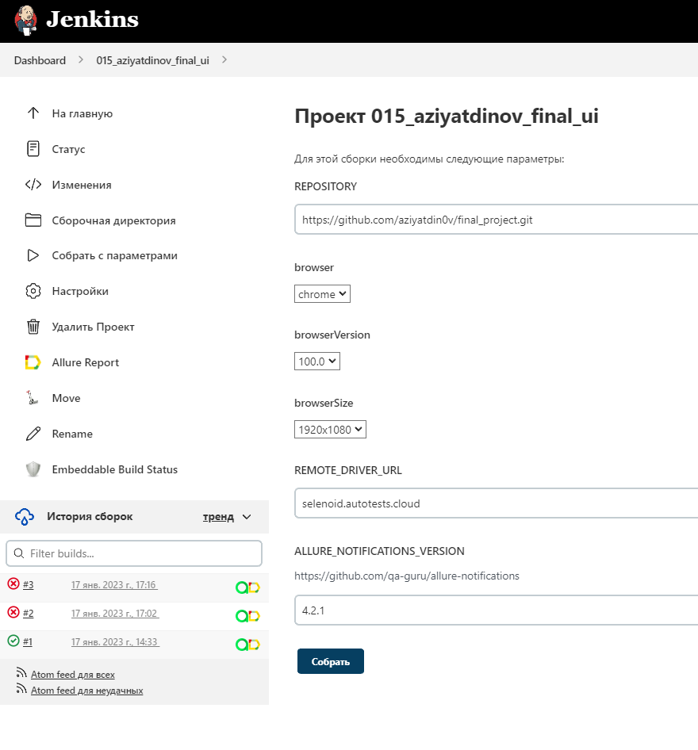
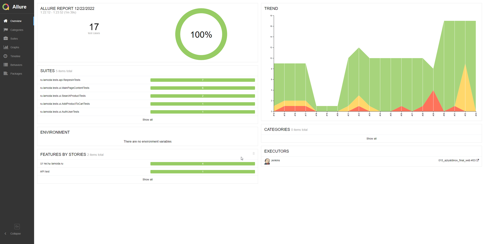
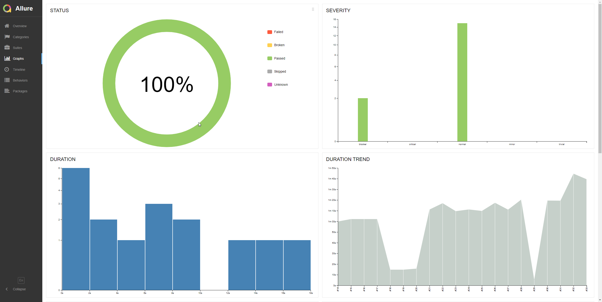
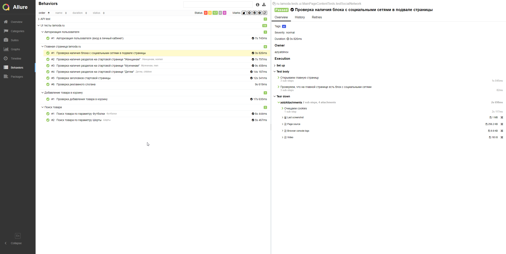
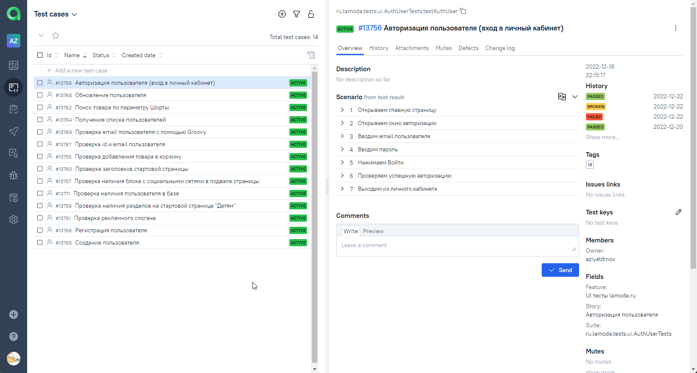
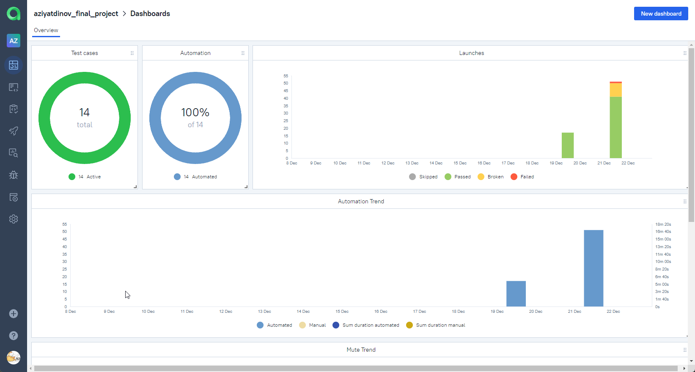
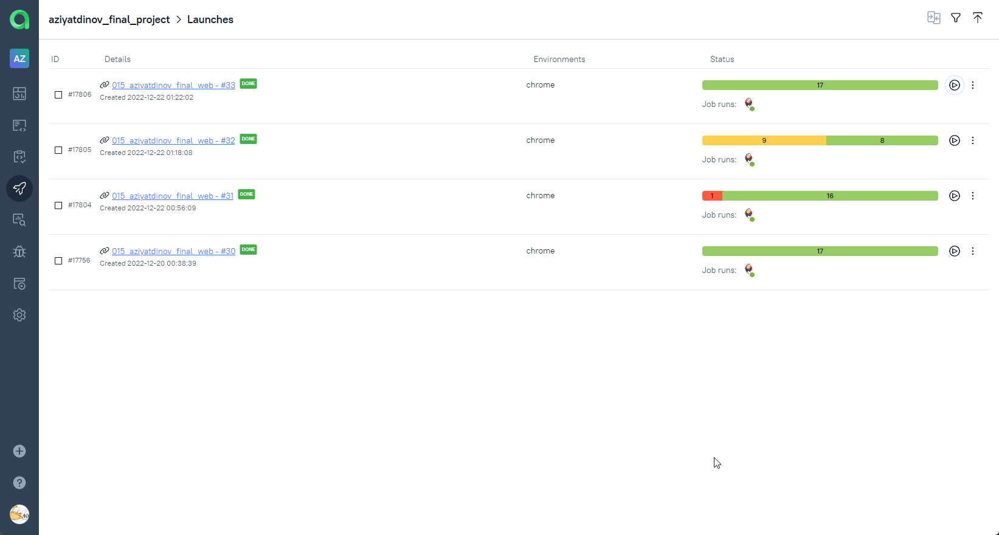

# Дипломный проект по тестированию интернет-магазина [Lamoda](https://www.lamoda.ru/)

## :open_book: Содержание:

- [Технологии и инструменты](#gear-Технологии-и-инструменты)
- [Тест кейсы](#heavy_check_mark-Тест-кейсы)
- [Запуск тестов](#computer-запуск-тестов-из-терминала)
- [Примеры использования](#примеры-использования)
- [Запуск тестов в Jenkins](#-запуск-тестов-из-jenkins)
- [Allure отчет](#-allure)
- [Уведомления в Telegram](#-telegram)
- [Видео прохождения тестов](#movie_camera-видео-с-прогоном-тестов)
- [Интеграция с Allure TestOps](#-Allure-TestOps)

## :gear: Технологии и инструменты

<p align="left">
<a href="https://www.jetbrains.com/idea/"></a>
<a href="https://www.java.com/"></a>
<a href="https://github.com/"></a>
<a href="https://junit.org/junit5/"></a>
<a href="https://gradle.org/"></a>
<a href="https://selenide.org/"></a>
<a href="https://aerokube.com/selenoid/"></a>
<a href="https://github.com/allure-framework/allure2"></a>
<a href="https://www.jenkins.io/"></a>
<a href="https://web.telegram.org/"></a>
<a href="https://qameta.io/"></a>
</p>

В данном проекте автотесты написаны на **Java** с использованием фреймворка для тестирования **Selenide**. Для сборки проекта в среде **IntelliJ IDEA** используется **Gradle**.
**JUnit5** задействован в качестве фреймворка модульного тестирования. Запуск тестов выполняется из **Jenkins**. **Selenoid** используется для запуска браузеров в контейнерах **Docker**.

**Allure Report**, **AllureTestOps** и **Telegram Bot** используются для визуализации результатов тестирования.

## :heavy_check_mark: Тест кейсы

- Проверка добавление товара в корзину
- Проверка аутентификации пользователя
- Проверка наличия заголовков главной страницы
- Проверка наличия разделов на главной странице
- Проверка наличия рекламного слогана
- Проверка наличия блока c социальными сетями в подвале страницы
- Проверка поиска заданного товара

## :computer: Запуск тестов

### :house_with_garden:	Локальный запуск тестов

```bash
gradle clean test
```

### :earth_asia: Удаленный запуск тестов из Jenkins

```bash
gradle clean test
-Dbrowser=${browser}
-DbrowserVersion=${browserVersion}
-DbrowserSize=${browserSize}
-DremoteDriverUrl=https://%s:%s@${REMOTE_DRIVER_URL}/wd/hub/
-DvideoStorage=https://${REMOTE_DRIVER_URL}/video/
```
## Примеры использования

### Для запуска удаленных тестов необходимо заполнить remote.properties или передать значение:

* browser (браузер, по умолчанию chrome)
* browserVersion (версия браузера, по умолчанию 100.0)
* browserSize (размер окна браузера, по умолчанию 1920x1080)
* remoteDriverUrl (url адресс selenoid)
* videoStorage (url адрес с видео прохождения тестов)
* threads (количество потоков)

Запуск тестов с заполненным remote.properties:
```bash
gradle clean test
```

Запуск тестов с незаполненным remote.properties:
```bash
gradle clean test -Dbrowser=chrome -DbrowserVersion=100.0 -DbrowserSize=1920x1080 -DremoteDriverUrl=https://%s:%s@selenoid.autotests.cloud/wd/hub/ -DvideoStorage=https://selenoid.autotests.cloud/video/ -Dthreads=1
```

##  Запуск тестов из [Jenkins](https://jenkins.autotests.cloud/job/015_aziyatdinov_final_web/)
Для запуска сборки необходимо перейти в раздел <code><strong>*Собрать с параметрами*</strong></code> и нажать кнопку <code><strong>*Собрать*</strong></code>.

<p align="center">
  
</p>

## :bar_chart: Отчеты о прохождении тестов доступны в Allure
###  Allure

#### Главная страница



#### Графики



#### Тесты



###  Telegram

Настроено автоматическое оповещение о результатах сборки Jenkins в Telegram-бот


## :movie_camera: Видео с прогоном тестов

В отчетах Allure для каждого теста прикреплен не только скриншот, но и видео прохождения теста

<p align="center">
  
</p>

##  Allure TestOps

## Полная статистика по прохождению тестпланов, отчёты и приложения к ним

### Представлены тест-кейсы



### Представлены дашборды аналитики



### Представлены запуски

